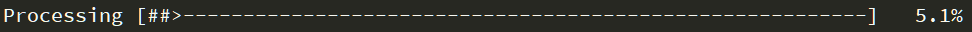

# Paticle/Cell tracking (Matlab)


## 0. Overview

This repo contains the source codes for tracking particles motion with Matlab. For now, we can only do tracking with fluorescent OR dark filed movies (i.e., the objects should be brighter than the background).

The function can work with Matlab 2018a and should be OK with previous Matlab version (early to 2014a) too. In early Matlab, function ```imwrite``` may cause problems when saving an image into ```'.tif'``` stack with Windows OS.

Both '.tif' stack and '.nd2' NIS-Elements files are supported. If your movie (or images) are in another format, such as ```'.avi'``` or ```'.jpg'```, you can transform the movie into a ```'.tif'``` stack with ImageJ.

The movie should be in grayscale (uint16 or unit8). For '.nd2' file, the movie file should be in one series. Now the script use [nd2reader](https://github.com/JacobZuo/nd2reader) to load '.nd2' file into Matlab. It also provied a Linux version at [nd2reader-linux](https://github.com/JacobZuo/nd2reader-linux). If you are familar with with [Bio-Format](https://www.openmicroscopy.org/bio-formats/), you can change this repo to 'ND2withBioFormat' channel to do tracking with [Bio-Format](https://www.openmicroscopy.org/bio-formats/).

## 1. Installation

For users working with ```git on Windows```, you can fork/clone the repo with.

``` sh
git clone git@github.com:JacobZuo/Tracking.git Tracking
```

If you do not get the nd2reader submodule automatically, try

``` sh
git submodule update --init
```

For users directly download the ```.zip``` file from Github, you need to download [nd2reader](https://github.com/JacobZuo/nd2reader) manually.

For users working with linux, you can clone both ```Trakcing``` and ```nd2reader-linux``` to your working path, 

```bash
git clone git@github.com:JacobZuo/Tracking.git Tracking
git clone git@github.com:JacobZuo/nd2reader-linux.git nd2reader 
```

Then you can copy the files in nd2reader into Tracking and overwriter the original files.

```bash
sudo rm -rf Tracking/nd2reader/
sudo cp -rf nd2reader/ Tracking/
```

Enjoy.

## 2. Usage

### 2.1 Basic usage

You can use the following command to track the particle/cell motion in the file of ```FileName```. ```FileName``` should contain the full path and extension name, such as ```'D:\Data\Test.tif'```.

```matlab
[Trace_All, ImageInfo] = Tracking(FileName)
```
The funtion will return two result as a cell data ```Trace_All``` and a structure data ```ImageInfo```. 

Each cell in ```Trace_All``` will be one trajectory in the movie. The data are recorded in a 2D array. The first column ```Trace_All{1}(:,1)``` record the frame number. The second and third columns ```Trace_All{1}(:,2:3)``` record the 'x' and 'y' coordinates of the particle/cell location in each frame. And the last column ```Trace_All{1}(:,4)``` record the cell size (pixels in area) we measured in each frame.

Structure ```ImageInfo``` will record some basic information of the movie file. Such as width and height of the image ```ImageInfo.ImageWidth, ImageInfo.ImageHeight```, length of the movie ```ImageInfo.numImages```, and the frames series we use for tracking for multi-channel condtition ```ImageInfo.TrackImageIndex```.

Running the function will also save two data files under the same path of the movie file, a binary ```'.tif'``` stack of the movie and a ```'.mat'``` Matlab data file contains all the intermediate variables.

You can also do tracking with a B/W image with

```matlab
[Trace_All, ImageInfo] = TrackingBW(BWImage)
```

```BWImage``` can be a matrix of binary images in Matlab workspace or a filename with full path of the binary images data in ```.mat``` file or an binary ```.tif``` stack.

### 2.2 Parameter options

#### 2.2.1 Setting parameters

You can set parameters for ```Tracking``` with the command below.

```matlab
[Trace_All, ImageInfo] = Tracking(FileName, 'Parameter', value)
 ```
For ```string``` type value, you shold use ```''```. Such as,

```matlab
[Trace_All, ImageInfo] = Tracking(FileName, 'AutoThreshold', 'on')
```

#### 2.2.2 Split channels

If your movie stack is a multi-channel series of loops as 'fluorescent image - bright filed image', you can use parameters ```ChannelNum``` and ```TrackChannel``` to split the stack.

The command below will split the stack into 2 channels by auto-detect the fluorescent image as the image 'darker' than the other one.

```matlab
[Trace_All, ImageInfo] = Tracking(FileName, 'ChannelNum', 2)
```

You can also specify the channel you want to track with ```TrackChannel```.

```matlab
[Trace_All, ImageInfo] = Tracking(FileName,'ChannelNum', 3, 'TrackChannel', 2)
```
The above command will split the stack into 3 channels and do particle/cell tracking at 2nd channel, i.e., with No. 2, 5, 8... images.

The ```ChannelNum``` is set to ```ChannelNum = 1``` as default.

#### 2.2.3. Background normalization

Fluorescent images acquired with wild-field fluorescent microscope may show brighter center and darker corners. We automatically normalization the image with a Gaussian peak fitting for background. Set ```Normalization``` ```'off'``` will stop auto normalization.

```matlab
[Trace_All, ImageInfo] = Tracking(FileName, 'Normalization', 'off')
```

Stucked particles/cells in the movie may cause a wrong detection of background and lead to a 'warning' of badly background fitting.

#### 2.2.4 Threshold auto-adjust

The program would automatically detect the threshold for the movie to transfer the grayscale image into B/W image for cell detection. You can also set the threshold your self.

```matlab
[Trace_All, ImageInfo] = Tracking(FileName, 'AutoThreshold', 'off', 'BlurSize', 1.5，...
     'ExtensionRatio', 2)
```
Firstly, the image will be blurred with Gaussian filter to remove the obvious noise on the background. Then the threshold is set as ```mean intensity of the background``` ```+``` ```standard deviation of the background noise``` ```*``` ```ratio```. At last the B/W image are revised with ```activecontour```. ```BlurSize``` will set the radius for gauss blurring. ```ExtensionRatio``` set the ratio in the threshold.

When set ```'AutoThreshold'``` ```'off'``` without specify the parameter value. The default values will be applied as below.
```matlab
BlurSize = 1.5; ExtensionRatio = 2;
```

### 2.3 Advanced usage

#### 2.3.1 Particle/cell size control

To control the quality of the binary image, the default particle/cell size (area in binary image) is set as 120 pixels in function ```CellSizeControl```.

```matlab
CellSize_default = 120;
```
The mean cell size would be around ```CellSize_default``` after appling ```CellSizeControl```. You can change the default cell size to acquire a better auto threshold result. 

If you would like to turn off auto cell size adjustment. You can use the following command.

```matlab
[Trace_All, ImageInfo] = Tracking(FileName, 'AutoCellSzie', 'off')
```

#### 2.3.2 Noise level

The area smaller than 5 pixels would be taken as 'noise' on background during the threshold test. 

```matlab
NoiseNum(BlurSize_index, ExtensionRatio_index) = sum(CellSize < 5);
```
When adjustiing threshold, we try to balance the cell number detected and noise level, i.e., detect as more cells as we can with lowest noise ```NoiseNum < 3```. Both the size of the noise pixels and the allowable number of noise areas can be adjusted in ```TheresholdTest```.

The residual noise pixels will be abandoned in cell size control.

#### 2.3.3 Particle/cell density

For better tracking result, the detected particle/cell density should be around 100 to 200 per frame. If there are too few cells, a missing or a new comming cell may cause wrong connections between frames. If there are too many cells, the collision between cells may also cause wrong connections.

There will be a warning if there are too few or too many cells detected in some of the frames. Try to check and adjust the threshold to obtain a better tracking result.

#### 2.3.4 Efficiency

Reading the image into Matlab is the most slowly process in the full function. The images are loaded and processed one by one in Matlab, as for some of the cases, it is hard to load all the data (in tens of GB, out of RAM) into Matlab at once. If you RAM is large enough, you can change the image loading part in ```BW_All``` could obtain better efficiency. Using a ```parfor``` to load and process the image will be faster.

Now the program use ```imerode``` and ```imdilate``` to adjust cell size to achieve better efficiency. You can also use ```activecontour``` to acquire better B/W image. 

```matlab
[Trace_All, ImageInfo] = Tracking(FileName, 'ActiveContourStatus', 'on', 'ActiveContourTimes', 10)
```

Function ```activecontour``` can work independent of ```CellSizeControl```.

```matlab
[Trace_All, ImageInfo] = Tracking(FileName, 'AutoCellSize', 'off', 'ActiveContourStatus', 'on', ...
     'ActiveContourTimes', 10)
```
#### 2.3.5 Tracking with local maximal

You can find the object without the local maximal method.

```matlab
Tracking(FileName,'Method','LocalMaximal')
```

Default, the ```LocalMax``` function will generate the local maximal pixel in range of 6 pixels. The local maxima will be filtered with auto tolerance. With the auto tolerance, only the pixel which is significantly brighter than the other pixels around it would be regarded as the object. You can also set the ```Range``` and ```Tolerance``` manually.

```matlab
Tracking(FileName,'Method','LocalMaximal', 'Range', 9, 'Tolerance', 200)
```
The value of ```Tolerance``` should be the intensity difference between the local maximal pixel and the median of pixels around it.

## 3. Appended functions

### 3.1 Process bar

There is a processing bar in ```[##>---]``` style displayed in Matlab command window when running ```for``` loops during tracking.

The function ```DisplayBar``` is used to display the processing bar. The number of ```#``` on the screen indicates the percentage of the progress. The process bar is 80 characters in width. You can also use the process bar in all ```for``` loops as below,

```matlab
for Index = 1:Length
    ......
    [Percentage, Barlength] = DisplayBar(Index, Length);
end
```
The bar would be shown in the command windows as below.




### 3.2 Trace trimmer

The trimmer function provides a tool to trim the trajectories.

```matlab
[Trace_Trimmed] = TraceTrimmer(Trace_All)
```

If the cell size in one trajectory changed more than 80%, i.e. smaller than 20% of the mean size or larger than 180% of the mean size, we will cut the trajectory based on cell size. 

```matlab
[Trace_Trimmed] = TraceTrimmer(Trace_All, MinLength)
```

Using ```MinLength``` will keep the trajectories longer than the ```MinLength```. Set ```MinLength = 0``` will keep all trajectories.

### 3.3 Trace player

This function provides a small tool to show the single trace in Matlab ```implayer```.

```matlab
[TraceMovie] = TracePlayer(ImageInfo, Trace)
```
You need to load the ```.mat``` file saved with ```Tracking``` function and running the above command to play the trajectory ```Trace```. There will be a white box on the cell body that indicated the cell in the ```Trace```.
